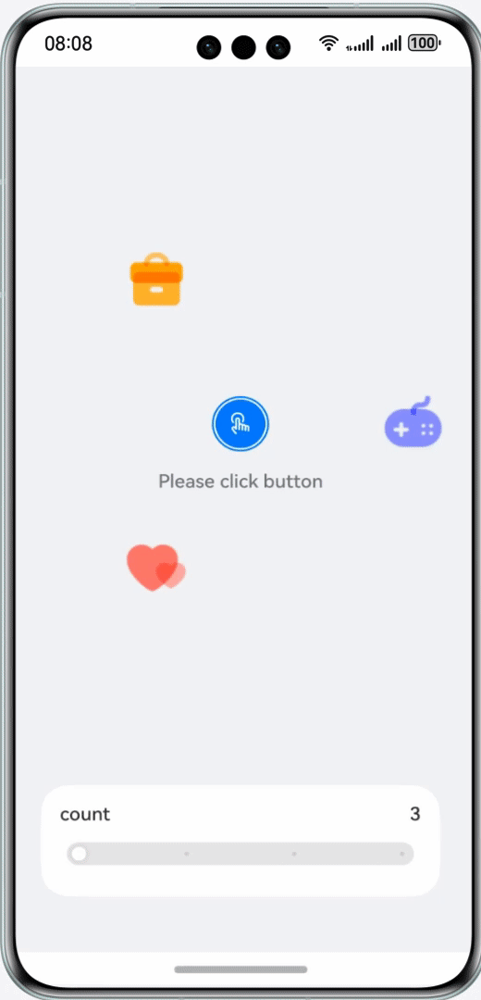

# Animation

### Introduction

Learn how to add animation to component properties based on ArkTS to improve user experience.

This codelab introduces the following functions:

- Tap the central button to see the animation icons rotating out from the center. Tap the central button again to see the animation icons returning to the center.
- Tap a single icon to trigger the animations of scaling, rotation, and opacity of the icon.
- Move the slider to control the number of animation icons. The number ranges from 3 to 6.

Example:



### Project Structure
```
├──entry/src/main/ets                // Code area
│  ├──common
│  │  └──constants
│  │     └──Const.ets                // Constants
│  ├──entryability
│  │  └──EntryAbility.ets            // Application entry
│  ├──pages
│  │  └──Index.ets                   // Animation page entry
│  ├──view
│  │  ├──AnimationWidgets.ets        // Animation components
│  │  ├──CountController.ets         // Icon count controller component
│  │  └──IconAnimation.ets           // Icon property animation component
│  └──viewmodel
│     ├──IconItem.ets                // Icon
│     ├──Point.ets                   // Icon coordinates
│     └──IconsModel.ets              // Icon model
└──entry/src/main/resources          // Resource files                 
```

### Concepts

- Explicit animation (**animateTo**): provides a transition animation when the status changes due to the closure code.

- Property animation: animates changes to certain component properties, such as **width**, **height**, **backgroundColor**, **opacity**, **scale**, **rotate**, and **translate**.

- Slider: a component that is used to adjust settings, such as the volume and brightness.

### How to Use

1. Tap the central button on the home page to see the animation icons rotating out from the center. Tap the central button again to see the animation icons returning to the center.
2. Drag the slider to control the number of animation icons, ranging from 3 to 6.
3. Tap a single icon to view the animations of rotation and opacity.

### Constraints

1. The sample is only supported on Huawei phones with standard systems.
2. HarmonyOS: HarmonyOS 5.0.5 Release or later.
3. DevEco Studio: DevEco Studio 6.0.2 Release or later.
4. HarmonyOS SDK: HarmonyOS 6.0.2 Release SDK or later.
