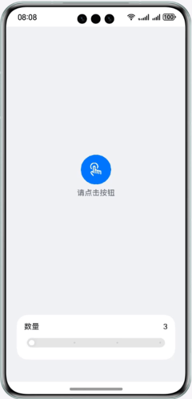

# 基于显式动画和属性动画实现简易动效

### 简介

本篇codelab通过animateTo显式动画接口和属性动画的能力，实现了一个简易的动效实例，帮助开发者掌握关于动画设置的基本能力

本篇codeLab实现如下功能

- 点击动画触发按钮，动画图标会由中心旋转而出，再次点击中心按钮，动画图标将由四周缩回。
- 点击单个图标会触发图标的缩放、旋转、透明度变化的动画效果。
- 调节滑动条会控制动画图标的数量，最少三个，最多六个。

效果如图所示:



### 工程结构
```

├──entry/src/main/ets                // 代码区
│  ├──common
│  │  └──constants
│  │     └──Const.ets                // 常量类
│  ├──entryability
│  │  └──EntryAbility.ets            // 程序入口类
│  ├──pages
│  │  └──Index.ets                   // 动效页面入口
│  ├──view
│  │  ├──AnimationWidgets.ets        // 动画组件
│  │  ├──CountController.ets         // 图标数量控制组件
│  │  └──IconAnimation.ets           // 图标属性动画组件
│  └──viewmodel
│     ├──IconItem.ets                // 图标类
│     ├──Point.ets                   // 图标坐标类
│     └──IconsModel.ets              // 图标数据模型
└──entry/src/main/resources          // 资源文件
```

### 相关概念

- 显式动画：提供全局animateTo显式动画接口来指定由于闭包代码导致的状态变化插入过渡动效。

- 属性动画：组件的某些通用属性变化时，可以通过属性动画实现渐变过渡效果，提升用户体验。支持的属性包括width、height、backgroundColor、opacity、scale、rotate、translate等。

- Slider：滑动条组件，通常用于快速调节设置值，如音量调节、亮度调节等应用场景。

### 使用说明

1. 进入首页点击按钮会有相应数量的图标由中心旋转而出，再次点击突变会由四周旋转缩回原点。
2. 滑动下方滑动条控制动画图标数量，最少显示3个动画图标，最多6个。
3. 点击单个图标会有旋转、透明度变化的动画效果。

### 约束与限制

1. 本示例仅支持标准系统上运行，支持设备：华为手机。
2. HarmonyOS系统：HarmonyOS 5.0.5 Release及以上。
3. DevEco Studio版本：DevEco Studio 6.0.2 Release及以上。
4. HarmonyOS SDK版本：HarmonyOS 6.0.2 Release SDK及以上。
